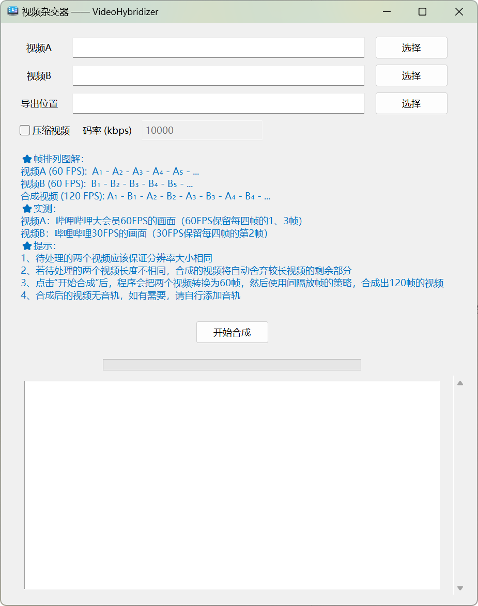

<p align="center">🇨🇳 中文简体  |  <a title="English" href="README_EN.md">🇬🇧 English</a></p>

# VideoHybridizer——视频 “杂交” 器

VideoHybridizer 是一个功能强大的工具，可以将两个视频流的帧交替排列，生成一个新的 120 fps 视频。

您可以将使用本程序合成的视频上传到在线视频平台（如哔哩哔哩），然后试着调整一下画质（帧率不同），您将能够看到完全不同的画面！

目前本程序仅支持 **Windows 7 及以上的 64 位**操作系统。



> [!TIP]
> 本程序具有以下特性：
>
> - **支持多种格式**：本程序支持多种输入和输出视频格式，如 MP4、AVI、MOV、MKV、WMV 等；
> - **支持自定码率**：本程序支持自定义码率，可以压缩视频；
> - **直观用户界面**：本程序具有直观的图形用户界面（GUI），易于操作；
> - **实时显示进度**：本程序可以实时显示视频处理的进度；
> - **记录处理日志**：本程序会记录处理过程中的详细信息，方便用户查看。

> [!NOTE]
> 使用本程序时需注意以下几点：
>
> 1. 待处理的两个视频应保证分辨率相同；
> 2. 若待处理的两个视频长度不相同，合成后的视频将自动舍弃较长视频的剩余部分；
> 3. 点击 “开始合成” 按钮后，程序会先将两个视频转换为 60 fps，然后使用[间隔放帧的策略](#运行原理)，合成出 120 fps 的视频；
> 4. 目前本程序只处理视频的画面，因此合成后的视频没有声音，如有需要，您可以使用其他软件给合成后的视频手动添加声音。

## 运行原理

假设 A<sub>n</sub> 为视频 A 中的第 n 帧，B<sub>n</sub> 为视频 B 中的第 n 帧。

**视频 A (60 fps)：**

| A<sub>1</sub> | A<sub>2</sub> | A<sub>3</sub> | A<sub>4</sub> |      ……      |
| ------------- | ------------- | ------------- | ------------- | ------------ |

**视频 B (60 fps)：**

| B<sub>1</sub> | B<sub>2</sub> | B<sub>3</sub> | B<sub>4</sub> |      ……      |
| ------------- | ------------- | ------------- | ------------- | ------------ |

**合成后的视频 (120 fps)：**

| A<sub>1</sub> | B<sub>1</sub> | A<sub>2</sub> | B<sub>2</sub> | A<sub>3</sub> | B<sub>3</sub> | A<sub>4</sub> | B<sub>4</sub> |      ……      |
| ------------- | ------------- | ------------- | ------------- | ------------- | ------------- | ------------- | ------------- | ------------ |

## 常见问题

### 运行程序后，为什么会出现一个黑色的控制台窗口，我可以关掉它吗？

不可以！如果关闭控制台窗口，程序也会被终止。出现黑色的控制台窗口是因为默认情况下，Python 解释器会在运行脚本时打开一个控制台窗口来显示标准输出和错误信息。

### 点击 “开始合成” 按钮后，程序一直卡住？

请先确认输入视频的格式是否被本程序支持，且视频播放不存在问题，不建议使用超级大的视频或者格式不标准的视频。

### 在哔哩哔哩选择不同帧率的画质，看到的合成后的视频是怎样的？

- 在选择 **60 fps** 画质（仅大会员与部分视频可用）时，B 站会对合成后的视频中的每 4 帧保留其中的第 1、3 帧，即 A<sub>1</sub>、A<sub>2</sub>、A<sub>3</sub>、A<sub>4</sub> 等；
- 在选择 **30 fps** 画质时，B 站会对合成后的视频中的每 4 帧保留其中的第 2 帧，即 B<sub>1</sub>、B<sub>3</sub>、B<sub>5</sub>、B<sub>7</sub> 等。

所以在不同帧率的画质下能看到完全不同的画面。

### 如何在本地看到 “杂交” 的效果？

1. 将设备的屏幕刷新率设置为 60 Hz；
2. 尝试打开视频多次，您看到的画面应该有时候是视频 A 中的，有时候是视频 B 中的。

当然，您在播放的时候可能会出现画面闪烁，原因是：

1. 偶尔的闪烁是正常现象，因为播放器渲染视频时可能无法做到完全稳定；
2. 设备的配置不够，渲染视频的速度比播放的速度慢，导致播放的帧错位。

解决方法：换设备（~~bushi~~），勾选程序中的 “压缩” 选项，使视频的码率降低，减轻设备负担

### 能否在后续版本中给合成后的视频添加声音，如左声道使用视频 A 的声音，右声道使用视频 B 的声音？

这个想法不错，但是我们暂时没有精力去编写这个功能的代码。若您能编写出实现此功能的代码，我们欢迎您提交 Pull Request。

## 贡献

欢迎大家为本项目提出建议与做出贡献，我们欢迎您提交 Issue 或 Pull Request 到本仓库！

若您想要在源代码的基础上进行进一步开发，您需要：

1. 准备必要软件：

- Python 3.x
- pip（Python包管理工具）

2. 安装库：

```bash
pip install opencv-python moviepy pywin32
```

## 许可证

此项目使用 [MIT 许可证](LICENSE)。

## ⭐ Star History

[](https://star-history.com/#happycola233/VideoHybridizer&Date)
