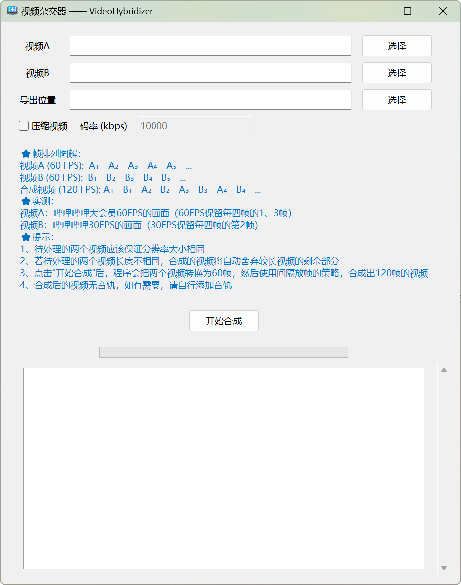

<p align="center"><a title="中文" href="/README.md">🇨🇳 中文简体</a> | 🇬🇧 English</p>

# VideoHybridizer

VideoHybridizer is a powerful tool that interleaves frames from two video streams to generate a new video at 120 fps.

You can upload the synthesized video created with this program to online video platforms (such as Bilibili, a well-known video platform in China), then adjust the quality (different frame rates) to see completely different visuals!

Currently, this program supports **Windows 7 and above, 64-bit** operating systems.



> [!TIP]
> This program features:
>
> - **Multiple Format Support**: Supports various input and output video formats such as MP4, AVI, MOV, MKV, WMV, etc.
> - **Custom Bitrate Support**: Allows custom bitrate settings for video compression.
> - **Intuitive User Interface**: Has a user-friendly graphical interface (GUI) for ease of use.
> - **Real-time Progress Display**: Shows real-time progress of video processing.
> - **Log Tracking**: Logs detailed processing information for user reference.

> [!NOTE]
> Consider the following when using this program:
>
> 1. Ensure that both videos to be processed have the same resolution.
> 2. If the lengths of the videos differ, excess frames from the longer video will be discarded after synthesis.
> 3. After clicking the "Start Synthesis" button, the program converts both videos to 60 fps first, then uses [frame interleaving strategy](#operational-principle) to synthesize a video at 120 fps.
> 4. Currently, this program processes only video frames, so the synthesized video will be without sound. If needed, you can manually add audio using other software.

## Operational Principle

Let A<sub>n</sub> denote the nth frame from video A, and B<sub>n</sub> denote the nth frame from video B.

**Video A (60 fps):**

| A<sub>1</sub> | A<sub>2</sub> | A<sub>3</sub> | A<sub>4</sub> |      ...      |
| -------------- | -------------- | -------------- | -------------- | ------------- |

**Video B (60 fps):**

| B<sub>1</sub> | B<sub>2</sub> | B<sub>3</sub> | B<sub>4</sub> |      ...      |
| -------------- | -------------- | -------------- | -------------- | ------------- |

**Synthesized Video (120 fps):**

| A<sub>1</sub> | B<sub>1</sub> | A<sub>2</sub> | B<sub>2</sub> | A<sub>3</sub> | B<sub>3</sub> | A<sub>4</sub> | B<sub>4</sub> |      ...      |
| -------------- | -------------- | -------------- | -------------- | -------------- | -------------- | -------------- | -------------- | ------------- |

## FAQs

### Why do I see a black console window when running the program, and can I close it?

No, you cannot close it! Closing the console window will terminate the program. The appearance of the black console window is because by default, the Python interpreter opens a console window to display standard output and error messages when running scripts.

### The program seems stuck after clicking "Start Synthesis." What should I do?

First, ensure that the input video formats are supported by the program and that the videos play correctly. Avoid using very large videos or videos with non-standard formats.

### What does the synthesized video look like when selecting different frame rates on Bilibili?

- Choosing **60 fps** quality (available only to premium members and for certain videos) retains the 1st and 3rd frames from each set of 4 frames in the synthesized video, i.e., A<sub>1</sub>, A<sub>2</sub>, A<sub>3</sub>, A<sub>4</sub>, etc.
- Choosing **30 fps** quality retains the 2nd frame from each set of 4 frames in the synthesized video, i.e., B<sub>1</sub>, B<sub>3</sub>, B<sub>5</sub>, B<sub>7</sub>, etc.

Thus, different frame rate qualities on Bilibili show completely different visuals.

### How can I see the hybrid effect locally?

1. Set your device's screen refresh rate to 60 Hz.
2. Open the video multiple times; you should see frames from video A sometimes and frames from video B at other times.

You might experience screen flickering during playback due to:

1. Occasional flickering is normal as video players may not render frames perfectly stable.
2. Your device might not have enough resources to render frames at the same rate as playback, causing frame misalignment.

Solution: Change devices (~~bushi~~), check the "Compression" option in the program to reduce video bitrate and lighten device load.

### Can future versions add sound to the synthesized video, using video A's sound for the left channel and video B's sound for the right channel?

This is a great idea, but currently, we do not have plans to develop this feature. If you can code a solution for this feature, feel free to submit a Pull Request.

## Contribution

We welcome suggestions and contributions to this project. Please submit issues or Pull Requests to this repository!

If you wish to further develop on the source code, you will need:

1. Required Software:

- Python 3.x
- pip (Python package manager)

2. Install libraries:

```bash
pip install opencv-python moviepy pywin32
```

## License

This project is licensed under the [MIT License](LICENSE).

## ⭐ Star History

[](https://star-history.com/#happycola233/VideoHybridizer&Date)